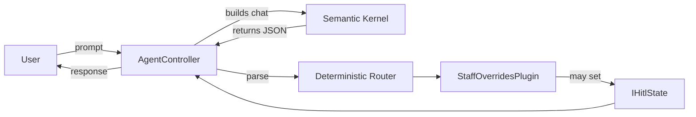

# AgenticWorkflowPoC

Last updated: 2026-08-31

Description
-----------
AgenticWorkflowPoC is a proof-of-concept demonstrating a safe, deterministic pattern for integrating LLMs into business flows. Instead of allowing the model to directly invoke tools, the LLM returns structured JSON and the server deterministically decides which plugin to execute.

Goals
-----
- Prevent the LLM from autonomously invoking functions (reduce hallucinations).
- Keep Human-in-the-Loop (HITL) state per-request via `IHitlState` (scoped DI).
- Provide unit and E2E tests that do not require external services (E2E uses a fake `IChatCompletionService`).

Repository structure
--------------------
- `src/AgenticWorkflowPoC.Api` — API, controllers and Kernel setup.
- `src/AgenticWorkflowPoC.Plugins` — plugins and `IHitlState` (scoped implementation).
- `src/AgenticWorkflowPoC.Core` — entities and interfaces.
- `src/AgenticWorkflowPoC.Infrastructure` — persistence (SQL skeleton).
- `tests/AgenticWorkflowPoC.Tests` — unit and integration tests.

Requirements
------------
- .NET 9 SDK
- (Optional) Local Ollama at `http://localhost:11434` with a compatible model (e.g. `llama3.1`) for real integrated runs.

Quickstart (local)
------------------
1. Restore dependencies and run tests:

```bash
dotnet restore
dotnet test AgenticWorkflowPoC.sln
```

2. Run the API locally:

```bash
dotnet run --project src/AgenticWorkflowPoC.Api
```

By default the app listens on `http://localhost:5000` (and `https://localhost:5001` if configured). If using Ollama, verify `Ollama:Endpoint` and `Ollama:Model` in `appsettings.json` or environment variables.

Example requests
----------------

Invoke (main flow):

```bash
curl -s -X POST http://localhost:5000/api/agent/invoke \
  -H "Content-Type: application/json" \
  -d '{"sessionId":"s1","prompt":"Change EMP-REQ-001 availability to 2026-09-01T09:00:00Z"}'
```

Example response (suspended due to conflict):

```json
{
  "status": "Suspended",
  "message": "A shift conflict was detected for staff EMP-REQ-001.",
  "sessionId": "s1"
}
```

Resume (after human decision):

```bash
curl -s -X POST http://localhost:5000/api/agent/resume/s1 \
  -H "Content-Type: application/json" \
  -d '{"isApproved":true}'
```

Design notes
------------
- Deterministic Router: the LLM must return only the expected JSON structure. The controller validates and determines which plugin to invoke.
- `IHitlState` is registered as `Scoped` and carries `IsSuspended` and `Reason` for the request; injected into plugins.
- Plugins are plain C# classes (e.g. `StaffOverridesPlugin`) that implement business rules and return deterministic results.

Simplified flow (Mermaid)



Basic test flow (CI-friendly)
---------------------------
1. Restore and run the test suite locally:

```bash
dotnet restore
dotnet test AgenticWorkflowPoC.sln --no-build
```

2. To run only tests in the test project:

```bash
dotnet test tests/AgenticWorkflowPoC.Tests --filter FullyQualifiedName~AgentController
```

Notes
-----
- E2E tests are deterministic: they replace `IChatCompletionService` with a fake implementation so CI doesn't require a running LLM.
- If you plan to run the API against a real LLM, be mindful of rate limits and credentials.

Contributing
------------
See `CONTRIBUTING.md` for PR and code-style guidance.

License
-------
Add a `LICENSE` file if you want to publish this repository.

Contact
-------
Open issues or PRs at https://github.com/emimaldo/agentic-workflow-poc

Important notes (2026-09-05)
-----------------------------
- The controller logic was refactored into `IAgentService` / `AgentService` to enforce SRP. Business logic and JSON parsing now live in `src/AgenticWorkflowPoC.Api/Services`.
- The model extraction prompt is centralized in `AgentDefaults.ExtractionPrompt`.
- The repository history was rewritten to remove accidentally committed secrets. If you cloned before 2026-09-05, please re-clone:

```bash
rm -rf agentic-workflow-poc
git clone https://github.com/emimaldo/agentic-workflow-poc.git
```

Run the full test suite after cloning:

```bash
dotnet restore
dotnet test AgenticWorkflowPoC.sln
```
