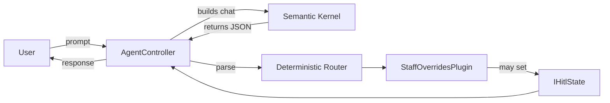

# AgenticWorkflowPoC

Última actualización: 2026-08-31

Descripción
-----------
AgenticWorkflowPoC es un proof-of-concept que muestra un patrón seguro y determinista para integrar LLMs en flujos de negocio. En lugar de permitir que el modelo invoque herramientas directamente, el LLM devuelve un JSON estructurado y el servidor —de forma determinista— decide qué `plugin` ejecutar.

Principales objetivos
- Evitar la invocación automática de funciones por parte del LLM (reducir al máximo las alucinaciones).
- Mantener el estado de HITL (Human-in-the-Loop) por petición mediante `IHitlState` (scoped DI).
- Proveer tests unitarios y E2E que no dependan de servicios externos (E2E usa un fake de `IChatCompletionService`).

Estructura del repositorio
- `src/AgenticWorkflowPoC.Api` — API web, configuración y controladores.
- `src/AgenticWorkflowPoC.Plugins` — plugins y `IHitlState` (implementación scoped).
- `src/AgenticWorkflowPoC.Core` — entidades e interfaces.
- `src/AgenticWorkflowPoC.Infrastructure` — persistencia (esqueleto SQL).
- `tests/AgenticWorkflowPoC.Tests` — pruebas unitarias e integración.

Requisitos
- .NET 9 SDK
- (Opcional) Ollama local en `http://localhost:11434` con un modelo compatible (ej. `llama3.1`) para pruebas integradas reales.

Quickstart (local)
------------------
1. Restaurar dependencias y ejecutar tests:

```bash
dotnet restore
dotnet test AgenticWorkflowPoC.sln
```

2. Ejecutar la API localmente:

```bash
dotnet run --project src/AgenticWorkflowPoC.Api
```

Por defecto la app expone endpoints en `http://localhost:5000` (o `https://localhost:5001` si está configurado). Si usás Ollama local, confirma `Ollama:Endpoint` y `Ollama:Model` en `appsettings.json` o variables de entorno.

Ejemplos de uso
---------------

Invoke (flujo principal):

```bash
curl -s -X POST http://localhost:5000/api/agent/invoke \
  -H "Content-Type: application/json" \
  -d '{"sessionId":"s1","prompt":"Change EMP-REQ-001 availability to 2026-09-01T09:00:00Z"}'
```

Respuesta (ejemplo de suspensión por conflicto):

```json
{
  "status": "Suspended",
  "message": "A shift conflict was detected for staff EMP-REQ-001.",
  "sessionId": "s1"
}
```

Resume (after human decision):

```bash
curl -s -X POST http://localhost:5000/api/agent/resume/s1 \
  -H "Content-Type: application/json" \
  -d '{"isApproved":true}'
```

Diseño técnico (resumen)
------------------------
- Deterministic Router: el LLM debe devolver únicamente JSON con la estructura esperada. El controlador valida el JSON y decide qué plugin invocar.
- `IHitlState` (scoped): mantiene la marca `IsSuspended` y la `Reason` por petición; inyectado en plugins.
- Plugins: clases C# (ej. `StaffOverridesPlugin`) que realizan comprobaciones de negocio y devuelven resultados deterministas.

Diagrama simplificado



Tests
-----
- Unitarios: validar lógica de plugins y controlador sin levantar la app.
- E2E: `WebApplicationFactory` con reemplazo de `IChatCompletionService` por un fake determinista.

Buenas prácticas / notas
-----------------------
- Para CI, los tests no necesitan Ollama ni OpenAI: los fakes proporcionan determinismo.
- Si querés usar un proveedor real, verificá límites y costos del proveedor (no incluidos en este PoC).

Contribuir
----------
- Seguí las pautas en `CONTRIBUTING.md`.

Licencia
--------
- Añadí un `LICENSE` si vas a publicar este repositorio públicamente.

Contacto
-------
- Abrí Issues o PRs en https://github.com/emimaldo/agentic-workflow-poc
